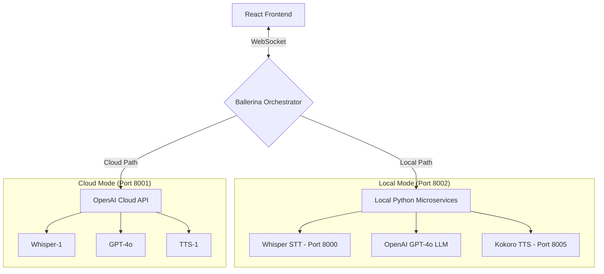

# Ballerina Voice Agent 🎙️

A high-performance, real-time voice assistant built with **Ballerina**, **React**, and modern AI models. This project demonstrates a hybrid architecture allowing users to toggle between **Cloud-based (OpenAI)** and **Local (Open Source)** processing.

---

## 🏗️ Architecture

The system follows a streaming-first architecture using **WebSockets** for low-latency full-duplex communication. 

### Core Components:
1.  **React Frontend**: Handles audio capture (MediaRecorder), volume visualization, and playback.
2.  **Ballerina Orchestrator**: Acts as the central brain. It receives audio frames, coordinates with STT/LLM/TTS services, and streams responses back.
3.  **Local Model Microservices**: In "Local" mode, Ballerina communicates with standalone Python microservices hosting the AI models via HTTP.



---

## 💻 Frontend (`/client`)

The frontend is a modern **React 19** application built with **Vite** and **TypeScript**.

-   **Real-time Interaction**: Uses WebSockets to stream audio and receive live transcripts/responses.
-   **Dynamic Visualizer**: An interactive GLOW orb built with **Framer Motion** that reacts to user volume and assistant state (recording, thinking, speaking).
-   **Conversation History**: Maintains a visual chat history for the current session.
-   **Port Switching**: Features a UI dropdown to switch between the OpenAI server (Port 8001) and the Local server (Port 8002).

---

## ⚙️ Server: OpenAI (`/server_OpenAI`)

A Ballerina-based service (Port 8001) that leverages OpenAI's high-fidelity cloud infrastructure.

-   **STT**: OpenAI `whisper-1`.
-   **TTS**: OpenAI `tts-1` (`alloy` voice).
-   **LLM**: OpenAI `gpt-4o` via `ballerina/ai` Agent.

---

## 🏠 Server: Local (`/server_local`)

A privacy-focused Ballerina service (Port 8002) that integrates with locally hosted open-source models.

-   **STT**: Local **Whisper (Base model)** running as a FastAPI microservice.
-   **TTS**: **Kokoro-82M** running as a Python microservice, providing ultra-fast synthesis.
-   **LLM**: Uses OpenAI's `gpt-4o` for reasoning (orchestrated by Ballerina).

---

## 🤖 Models Used

| Model | Role | Type | Description |
| :--- | :--- | :--- | :--- |
| **Whisper (Base)** | STT | Local | A multi-lingual speech recognition model known for its accuracy even in noisy environments. |
| **Kokoro-82M** | TTS | Local | A state-of-the-art, lightweight TTS model that delivers human-like speech with incredibly low latency. |
| **GPT-4o** | LLM | Cloud | The core logic engine, generating conversational and concise responses. |

---

## 🚀 Getting Started

### 1. Prerequisites
-   [Ballerina Swan Lake](https://ballerina.io/downloads/) installed.
-   [Python 3.10+](https://www.python.org/) for local models.
-   An OpenAI API Key.

### 2. Configuration
Create a `Config.toml` file in both `server_local/` and `server_OpenAI/`:
```toml
openaiToken = "your_openai_api_key_here"
```


## 🛠️ Project Structure

-   `client/`: React frontend application.
-   `server_local/`: Ballerina project for local model orchestration.
-   `server_OpenAI/`: Ballerina project for cloud model orchestration.
-   `models/`: Python source and weights for local models.
    -   `whisper-STT/`: OpenAI Whisper (Local).
    -   `kokoro-0.9.4-TTS/`: Kokoro TTS (Local).
